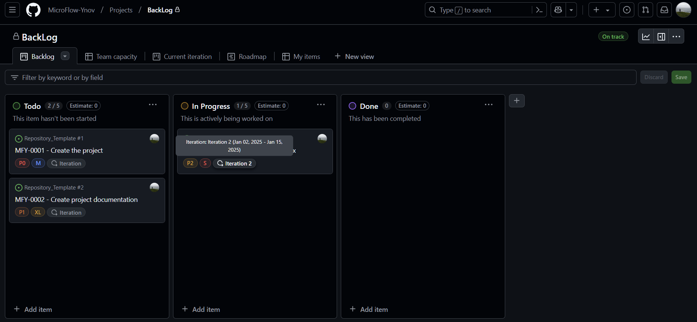
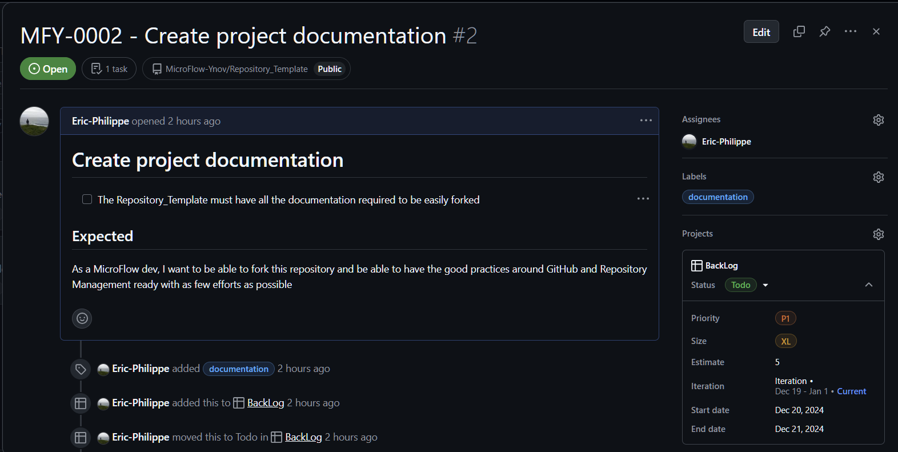

# Ynov 2024/205 - Compte Rendu évaluation - Intégation continue

## Éric PHILIPPE

Ce repository contient un résumé du travail effectué, suivant le sujet présent dans le fichier [CONSIGNES](./CONSIGNES.pdf).

---

**Important**, le rendu correspond à l'entièreté de [l'organisation MicroFlow-Ynov](https://github.com/MicroFlow-Ynov). L'organisation contient plusieurs repositories avec chacun un métier précis. Le repository [WebInterface](https://github.com/MicroFlow-Ynov/WebInterface) est un repository d'exemple pour la mise en place de l'intégration continue qui servira d'ultime référence tout au long de ce document.

## Table des matières

- [Ynov 2024/205 - Compte Rendu évaluation - Intégation continue](#ynov-2024205---compte-rendu-évaluation---intégation-continue)
  - [Table des matières](#table-des-matières)
  - [1. Définition de la stratégie DevOps](#1-définition-de-la-stratégie-devops)
    - [1.1. Stratégie CI/CD](#11-stratégie-cicd)
    - [1.2. Backlog des activités](#12-backlog-des-activités)
    - [1.3. Outils à utiliser](#13-outils-à-utiliser)
  - [2. Mise en place du pipeline CI/CD](#2-mise-en-place-du-pipeline-cicd)
    - [2.1. Automatisation des étapes](#21-automatisation-des-étapes)
  - [3. Gestion des branches et des releases](#3-gestion-des-branches-et-des-releases)
    - [3.1. Gestion des branches](#31-gestion-des-branches)
    - [3.2. Code reviews](#32-code-reviews)
    - [3.3. Releases](#33-releases)
  - [4. Gestion des notifications et collaboration entre équipes](#4-gestion-des-notifications-et-collaboration-entre-équipes)
    - [4.1. Notifications](#41-notifications)
    - [4.2. Collaboration](#42-collaboration)
  - [5. Suivi de la qualité et des bonnes pratiques DevOps](#5-suivi-de-la-qualité-et-des-bonnes-pratiques-devops)
    - [5.1. Analyse de la qualité du code](#51-analyse-de-la-qualité-du-code)
    - [5.2. Automatisation des tests](#52-automatisation-des-tests)

## 1. Définition de la stratégie DevOps

Ce premier chapitre a pour but de définir la stratégie DevOps à mettre en place pour l'organisation MicroFlow-Ynov.

### 1.1. Stratégie CI/CD

La stratégie CI/CD est un élément clé de la mise en place de l'intégration continue. Elle permet de définir les étapes à suivre pour la mise en place de l'intégration continue et de la livraison continue.

La stratégie CI/CD de l'organisation MicroFlow-Ynov se voit être découpées en deux temps:

Le premier temps est une mise à disposition d'outils et templates pour faciliter plus tard la mise en place de l'intégration continue. En ayant des outils prêts à l'emploi, le développeur sera alors plus à même de mettre en place du CI/CD sur ses projets.

Le second temps est la mise en place, présent dans un repository d'exemple [WebInterface](https://github.com/MicroFlow-Ynov/WebInterface). Ce repository contient un exemple de mise en place de l'intégration continue sur un projet `Vue.js`.

Le projet d'interface Web va impliquer une batterie de tests unitaires et fonctionnels, ainsi qu'une analyse de la qualité du code.
Une mise en production fréquente va impliquer une gestion des branches et des releases qui sera détaillée plus tard.

---

### 1.2. Backlog des activités

GitHub Organisations permet d'offrir des fonctionnalités avancées pour la gestion de projets, tout en centralisant le tout dans un seul et même endroit.

[Lien vers le Backlog](https://github.com/orgs/MicroFlow-Ynov/projects/1)

Ce dernier permet de rassembler les issues, user stories et autres tâches à réaliser pour le projet. Chaque issue est liée à un repository et une branche, et peut-être qualifiée d'urgence, de priorité, de difficulté, etc.

Chaque issue porte des règles et conventions dans son nomenclature et sa description. Actuellement, les issues doivent être nommées avec le préfix MFY (MicroFlow-Ynov) suivi de l'identifiant de l'issue. La description doit contenir un template de description pour faciliter la compréhension de l'issue.

Elle est ensuite catégorisée dans les différents tags disponibles (Bug, Documentation, Feature...).

On peut ensuite créer la branche en question et l'assigner au repository, pour que le développeur puisse travailler dessus.

Ce backlog permet alors de fonctionner idéallement avec des méthodes agiles et par sprint en ayant la possibilité de suivre l'avancement des tâches et de les attribuer à des "itérations".

### 1.3. Outils à utiliser

Pour la mise en place de l'intégration continue, plusieurs outils sont nécessaires. Les outils utilisés par l'organisation MicroFlow-Ynov sont les suivants:

| Outil                | Description                                                                                           |
| -------------------- | ----------------------------------------------------------------------------------------------------- |
| **GitHub**           | Plateforme de gestion de code source et de projets                                                    |
| **Docker (Compose)** | Outil de conteneurisation pour les microservices                                                      |
| **Nexus Repository** | Outil de gestion de dépôts de paquets                                                                 |
| **SonarQube**        | Outil d'analyse de la qualité du code                                                                 |
| **Discord**          | Gestion des notifications et collaboration entre équipes                                              |
| **Proxmox**          | Outil de virtualisation pour les serveurs pour fournir des machines de production et de développement |
| **Ngnix**            | Serveur web pour la mise en production des applications                                               |
| **Grafana**          | Outil de monitoring pour suivre les performances des applications                                     |
| **Prometheus**       | Outil de monitoring pour suivre les performances des applications                                     |
| **Tailscale**        | VPN pour la connexion sécurisée entre les serveurs                                                    |

## 2. Mise en place du pipeline CI/CD

### 2.1. Automatisation des étapes

## 3. Gestion des branches et des releases

### 3.1. Gestion des branches

### 3.2. Code reviews

### 3.3. Releases

## 4. Gestion des notifications et collaboration entre équipes

### 4.1. Notifications

### 4.2. Collaboration

## 5. Suivi de la qualité et des bonnes pratiques DevOps

### 5.1. Analyse de la qualité du code

### 5.2. Automatisation des tests
