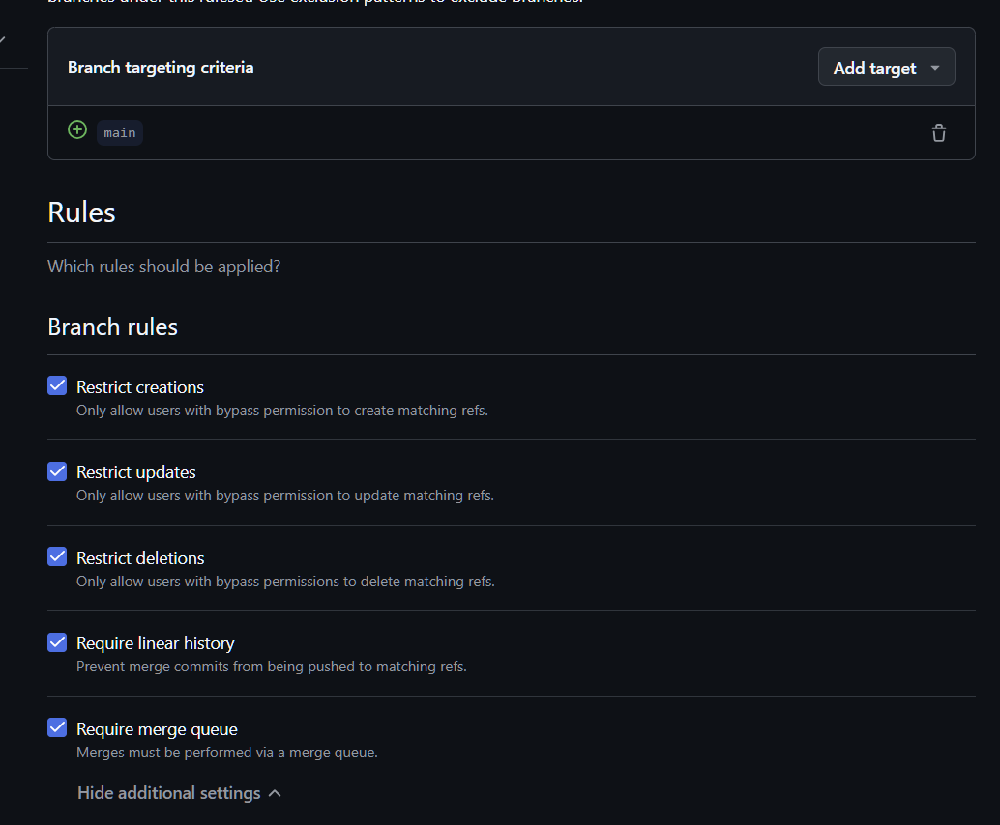

# Ynov 2024/205 - Compte Rendu évaluation - Intégation continue

## Éric PHILIPPE

Ce repository contient un résumé du travail effectué, suivant le sujet présent dans le fichier [CONSIGNES](./CONSIGNES.pdf).

---

**Important**, le rendu correspond à l'entièreté de [l'organisation MicroFlow-Ynov](https://github.com/MicroFlow-Ynov). L'organisation contient plusieurs repositories avec chacun un métier précis. Le repository [WebInterface](https://github.com/MicroFlow-Ynov/WebInterface) est un repository d'exemple pour la mise en place de l'intégration continue qui servira d'ultime référence tout au long de ce document.

## Table des matières

- [Ynov 2024/205 - Compte Rendu évaluation - Intégation continue](#ynov-2024205---compte-rendu-évaluation---intégation-continue)
  - [Table des matières](#table-des-matières)
  - [1. Définition de la stratégie DevOps](#1-définition-de-la-stratégie-devops)
    - [1.1. Stratégie CI/CD](#11-stratégie-cicd)
    - [1.2. Backlog des activités](#12-backlog-des-activités)
    - [1.3. Outils à utiliser](#13-outils-à-utiliser)
  - [2. Mise en place du pipeline CI/CD](#2-mise-en-place-du-pipeline-cicd)
    - [2.1. Automatisation des étapes](#21-automatisation-des-étapes)
  - [3. Gestion des branches et des releases](#3-gestion-des-branches-et-des-releases)
    - [3.1. Gestion des branches](#31-gestion-des-branches)
    - [3.2. Code reviews](#32-code-reviews)
    - [3.3. Releases](#33-releases)
  - [4. Gestion des notifications et collaboration entre équipes](#4-gestion-des-notifications-et-collaboration-entre-équipes)
    - [4.1. Notifications](#41-notifications)
    - [4.2. Collaboration](#42-collaboration)
  - [5. Suivi de la qualité et des bonnes pratiques DevOps](#5-suivi-de-la-qualité-et-des-bonnes-pratiques-devops)
    - [5.1. Analyse de la qualité du code](#51-analyse-de-la-qualité-du-code)
    - [5.2. Automatisation des tests](#52-automatisation-des-tests)
    - [5.3. Servers Pool](#53-servers-pool)
    - [5.4. Monitoring](#54-monitoring)
    - [5.5. VPN](#55-vpn)

## 1. Définition de la stratégie DevOps

Ce premier chapitre a pour but de définir la stratégie DevOps à mettre en place pour l'organisation MicroFlow-Ynov.

### 1.1. Stratégie CI/CD

La stratégie CI/CD est un élément clé de la mise en place de l'intégration continue. Elle permet de définir les étapes à suivre pour la mise en place de l'intégration continue et de la livraison continue.

La stratégie CI/CD de l'organisation MicroFlow-Ynov se voit être découpées en deux temps:

Le premier temps est une mise à disposition d'outils et templates pour faciliter plus tard la mise en place de l'intégration continue. En ayant des outils prêts à l'emploi, le développeur sera alors plus à même de mettre en place du CI/CD sur ses projets.

Le second temps est la mise en place, présent dans un repository d'exemple [WebInterface](https://github.com/MicroFlow-Ynov/WebInterface). Ce repository contient un exemple de mise en place de l'intégration continue sur un projet `Vue.js`.

Le projet d'interface Web va impliquer une batterie de tests unitaires et fonctionnels, ainsi qu'une analyse de la qualité du code.
Une mise en production fréquente va impliquer une gestion des branches et des releases qui sera détaillée plus tard.

---

### 1.2. Backlog des activités

GitHub Organisations permet d'offrir des fonctionnalités avancées pour la gestion de projets, tout en centralisant le tout dans un seul et même endroit.

[Lien vers le Backlog](https://github.com/orgs/MicroFlow-Ynov/projects/1)


Ce dernier permet de rassembler les issues, user stories et autres tâches à réaliser pour le projet. Chaque issue est liée à un repository et une branche, et peut-être qualifiée d'urgence, de priorité, de difficulté, etc.


Chaque issue porte des règles et conventions dans sa nomenclature et sa description. Actuellement, les issues doivent être nommées avec le préfix MFY (MicroFlow-Ynov) suivi de l'identifiant de l'issue. La description doit contenir un template de description pour faciliter la compréhension de l'issue.

Elle est ensuite catégorisée dans les différents tags disponibles (`Bug`, `Documentation`, `Feature`...).

On peut ensuite créer la branche en question et l'assigner au repository, pour que le développeur puisse travailler dessus.

Ce backlog permet alors de fonctionner idéallement avec des méthodes agiles et par sprint en ayant la possibilité de suivre l'avancement des tâches et de les attribuer à des "itérations".

### 1.3. Outils à utiliser

Pour la mise en place de l'intégration continue, plusieurs outils sont nécessaires. Les outils utilisés par l'organisation MicroFlow-Ynov sont les suivants:

| Outil                | Description                                                                                           |
| -------------------- | ----------------------------------------------------------------------------------------------------- |
| **GitHub**           | Plateforme de gestion de code source et de projets et gestionnaire de packages                        |
| **Docker (Compose)** | Outil de conteneurisation pour les microservices                                                      |
| **Nexus Repository** | Outil de gestion de dépôts de paquets                                                                 |
| **Husky**            | Outil de pré-commit pour les hooks git                                                                |
| **SonarQube**        | Outil d'analyse de la qualité du code                                                                 |
| **Discord**          | Gestion des notifications et collaboration entre équipes                                              |
| **Proxmox**          | Outil de virtualisation pour les serveurs pour fournir des machines de production et de développement |
| **Ngnix**            | Serveur web pour la mise en production des applications                                               |
| **Grafana**          | Outil de monitoring pour suivre les performances des applications                                     |
| **Prometheus**       | Outil de monitoring pour suivre les performances des applications                                     |
| **Tailscale**        | VPN pour la connexion sécurisée entre les serveurs                                                    |

## 2. Mise en place du pipeline CI/CD

### 2.1. Automatisation des étapes

Le pipeline CI/CD est mis en place dans le repository [WebInterface](https://github.com/MicroFlow-Ynov/WebInterface/actions). Il est composé de plusieurs étapes:

- 0. Avant chaque commit, husky est utilisé pour passer la banque de test sur l'environnement de développement. Il permet un premier passage des tests dans un environnement rodé et de pouvoir rapidement détecter des erreurs de base.


- 1. Control Compliance: Analyse minimale du code pour vérifier qu'il respecte les conventions de code à base des tests fonctionnels, d'un linter de base, et d'un build. Il permet une non regression générale du code et de pouvoir rapidement détecter des erreurs de base.

> Le control compliance s'applique sur les branches `feature/*` et `bugfix/*` et dans ce cas, s'arrête à ce moment.

- 2. SonarQube: Analyse de la qualité du code pour vérifier que le code respecte les conventions de code et les bonnes pratiques de développement.

> Le SonarQube s'applique en plus dès lors que le code est mergé dans la branche `release`.


```yml
# SonarQube scan on self-hosted SonarQube
- name: SonarQube Scan
  uses: sonarsource/sonarcloud-github-action@master
  env:
    GITHUB_TOKEN: ${{ secrets.GITHUB_TOKEN }}
    SONAR_TOKEN: ${{ secrets.SONAR_TOKEN }}
    SONAR_HOST_URL: ${{ secrets.SONAR_HOST_URL }}
    SONAR_PROJECT_KEY: ${{ secrets.SONAR_PROJECT_KEY }}
    SONAR_PROJECT_NAME: ${{ secrets.SONAR_PROJECT_NAME }}
```

> Si ce dernier est à succès, alors le code est mergé dans la branche `main`.

- 3. Docker Build: Construction de l'image Docker pour le projet et publication sur le registry Docker.


- 4. Génération de la documentation: Génération de la documentation développeur et utilisateur pour le projet.
- 5. Déploiement: Déploiement de l'application sur un serveur de stagging pour vérifier que l'application fonctionne correctement.
- 6. Production: Déploiement de l'application sur un serveur de production pour mettre en ligne l'application.
- 7. Notification: Envoi de notifications sur Discord pour informer les équipes de l'état final du déploiement avec un résumé complet du changelog.

## 3. Gestion des branches et des releases

### 3.1. Gestion des branches

Dans le repository [WebInterface](), la gestion des branches est faite de manière classique. On retrouve les branches suivantes:

- `main`: branche principale du projet, contenant le code en production, qui est protégée et ne peut être modifiée que par des Pull Requests
- `release/*.*.*`: branche de release, contenant le code en pré-production, qui est protégée et ne peut être modifiée que par des Pull Requests
- `bugfix/*`: branche de correction de bug
- `feature/*`: branche de développement de fonctionnalité



Les branches de `bugfix` et `feature` sont créées à partir de la branche `release` en cours. Une fois la fonctionnalité ou le bugfix terminé, une Pull Request est créée pour merger la branche dans la branche `release`.

Toutes les branches sont protégées et ne peuvent être modifiées que par des Pull Requests. Les Pull Requests sont soumises à des règles de validation avant de pouvoir être mergées.

### 3.2. Code reviews

A chacune des Pull Requests, une code review est demandée à un ou plusieurs reviewers. Les reviewers sont choisis en fonction de leur expertise sur le code à reviewer. Les reviewers doivent valider la Pull Request avant qu'elle ne puisse être mergée.

### 3.3. Releases

Les releases prennent la direction de la branche `release/*.*.*`. Une fois la branche `release` prête, c'est à dire, que le backlog est vide, que les tests sont passés, que la qualité du code est bonne, alors la branche `release` est mergée dans la branche `main`.

Sur chaque release est alors installé le package avec le container docker prêt à l'emploi directement dans GitHub Packages permettant une centralisation des packages et une facilité de déploiement.


## 4. Gestion des notifications et collaboration entre équipes

### 4.1. Notifications

Lors d'un succès ou bien d'un échec de pipeline, une notification est envoyée sur Discord pour informer les équipes de l'état du déploiement. La notification contient un résumé complet du changelog, des étapes effectuées, des erreurs rencontrées, et des correctifs apportés.


```yml
name: Discord Notification

on:
  workflow_run:
    workflows: ["Deploy to Production"]
    types:
      - completed

jobs:
  deploy:
    runs-on: ubuntu-latest
    steps:
      - name: Checkout code
        uses: actions/checkout@v2

      - name: Get Changelog
        id: get_changelog
        run: |
          echo "CHANGELOG=$(grep -A 5 '## \[' CHANGELOG.md | tail -n 5 | tr '\n' ' ')" >> $GITHUB_ENV

      - name: Send message to Discord on failure
        if: failure()
        env:
          COMMIT_MESSAGE: ${{ github.event.head_commit.message }}
          CHANGELOG: ${{ env.CHANGELOG }}
        run: |
          curl -X POST -H "Content-Type: application/json" \
          -d '{
                "content": "CI/CD Pipeline Failed!",
                "embeds": [
                  {
                    "title": "Deployment Status",
                    "description": "The latest deployment has failed.",
                    "color": 16711680,
                    "fields": [
                      {
                        "name": "Commit Message",
                        "value": "'"${COMMIT_MESSAGE}"'"
                      },
                      {
                        "name": "Changelog",
                        "value": "'"${CHANGELOG}"'"
                      }
                    ],
                    "footer": {
                      "text": "Check the details in the repository."
                    }
                  }
                ],
                "components": [
                  {
                    "type": 1,
                    "components": [
                      {
                        "type": 2,
                        "label": "View Repository",
                        "style": 5,
                        "url": "https://github.com/MicroFlow-Ynov"
                      }
                    ]
                  }
                ]
              }' \
          ${{ secrets.DISCORD_WEBHOOK_URL }}

      - name: Send message to Discord on success
        if: success()
        env:
          COMMIT_MESSAGE: ${{ github.event.head_commit.message }}
          CHANGELOG: ${{ env.CHANGELOG }}
        run: |
          curl -X POST -H "Content-Type: application/json" \
          -d '{
                "content": "CI/CD Pipeline Succeeded!",
                "embeds": [
                  {
                    "title": "Deployment Status",
                    "description": "The latest deployment was successful.",
                    "color": 65280,
                    "fields": [
                      {
                        "name": "Commit Message",
                        "value": "'"${COMMIT_MESSAGE}"'"
                      },
                      {
                        "name": "Changelog",
                        "value": "'"${CHANGELOG}"'"
                      }
                    ],
                    "footer": {
                      "text": "Check the details in the repository."
                    }
                  }
                ],
                "components": [
                  {
                    "type": 1,
                    "components": [
                      {
                        "type": 2,
                        "label": "View Repository",
                        "style": 5,
                        "url": "https://github.com/MicroFlow-Ynov"
                      }
                    ]
                  }
                ]
              }' \
          ${{ secrets.DISCORD_WEBHOOK_URL }}
```

### 4.2. Collaboration


L'entièreté de l'équipe se retrouve sous GitHub Organisations. Chaque membre de l'équipe a un rôle bien défini et des permissions adaptées à son rôle. Les permissions sont gérées par les owners de l'organisation.


Les différentes équipes profitent d'un forum dans l'onglet discussion permettant de discuter aussi bien en "public" qu'en "privé" sur des sujets divers et variés.


## 5. Suivi de la qualité et des bonnes pratiques DevOps

### 5.1. Analyse de la qualité du code

L'analyse de la qualité du code est assurée par SonarQube. Cet outil permet de suivre la qualité du code en temps réel et de détecter les problèmes avant qu'ils n'impactent les utilisateurs. SonarQube est configuré sur les serveurs de production et de staging permettant à quiconque de brancher sa configuration SonarQube sans avoir à la reconfigurer et lancer d'autres instances.


### 5.2. Automatisation des tests

Avant Sonarqube, durant les CI/CD, un contrôle de conformité est effectué pour vérifier que le code respecte les conventions de code à base des tests fonctionnels, d'un linter de base, et d'un build. Il permet une non regression générale du code et de pouvoir rapidement détecter des erreurs de base. Ces tests sont réalisés sur plusieurs versions de node afin d'assurer la compatibilité du code.


### 5.3. Servers Pool

L'etnièreté de l'infrastructure repose sous un Proxmox, qui permet de gérer les machines virtuelles et les conteneurs. Les serveurs sont configurés de la manière suivante:

- **Serveur de production**: Serveur principal, hébergeant les applications en production à l'aide de portainer. Il est configuré avec un Nginx pour la mise en production des applications, un Tailscale pour la connexion sécurisée entre les serveurs, un Grafana et un Prometheus pour le monitoring des applications.
- **Serveur de staging**: Serveur de pré-production, hébergeant les applications en pré-production. Il est configuré de la même manière que le serveur de production.
- **Serveur de développement**: Plusieurs petits serveurs de développement, hébergeant les applications en développement. Il est configuré de la même manière que le serveur de production.

[README Bonne pratiques de l'installation de services sur les serveurs](https://github.com/MicroFlow-Ynov/Infra/blob/main/prod/README.md)

> Interface de gestion Proxmox


### 5.4. Monitoring

Le monitoring des applications est assuré par Grafana et Prometheus. Ces deux outils permettent de suivre les performances des applications en temps réel et de détecter les problèmes avant qu'ils n'impactent les utilisateurs. Ces deux outils sont configurés sur les serveurs de production et de staging permettant à quiconque de brancher sa configuration Grafana sans avoir à la reconfigurer et lancer d'autres instances.


[Lien vers le compose de Monitoring](https://github.com/MicroFlow-Ynov/Infra/blob/main/monitoring/docker-compose.yml)

### 5.5. VPN

Le VPN Tailscale est utilisé pour la connexion sécurisée entre les serveurs. Il permet de connecter les serveurs entre eux de manière sécurisée et de les rendre accessibles uniquement aux personnes autorisées.

[Lien vers le serveur Tailscale](https://github.com/MicroFlow-Ynov/Infra/blob/main/vpn/docker-compose.yml)
